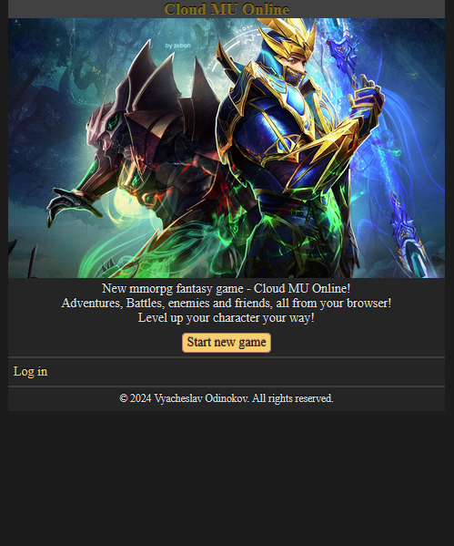
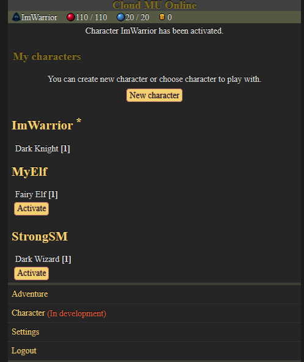
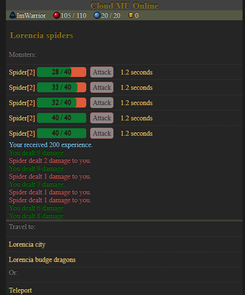
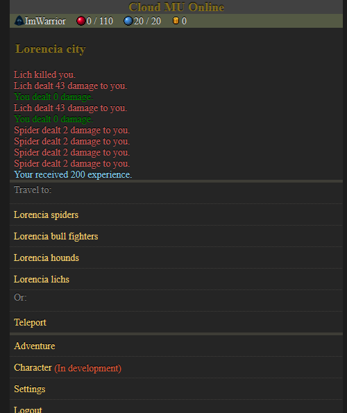
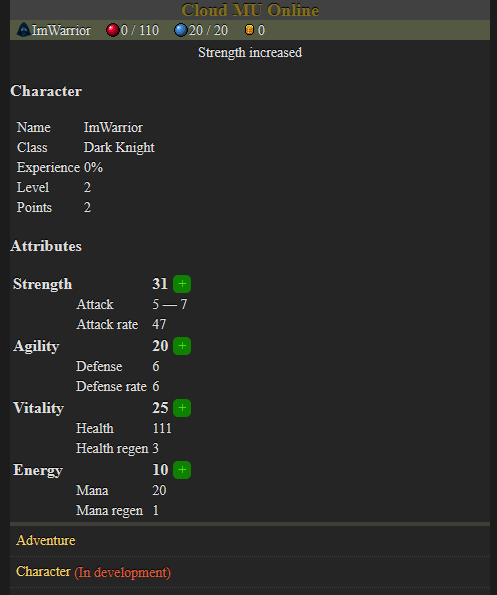

# README

Cloud Mu Online (CMO) is a browser-based MMORPG inspired by the classic Mu Online. Choose from various classes, level up your hero, and become stronger as you discover valuable items. Engage in open PvP battles with other players, and capture and hold the Castle to prove your dominance in the realm!

## Screenshots

- Welcome Screen<br>
On this screen, you can log into your existing account or start a new game quickly.<br>


- Character Creation Form<br>
Use this form to create a new character.<br>


- Characters Screen<br>
This is the character list. Here, players can create multiple characters and activate one to play with.<br>


- Combat (Adventure Screen)<br>
In this example, the character is attacking spiders. Each attack has a delay of 3 seconds. Combat logs are also available.<br>


- Death (Adventure Screen)<br>
Upon death, the character is teleported to the main location of the spot where they were defeated. Combat logs are also available.<br>


- Character Screen<br>
This screen shows character information, and the player can spend points to increase stats.<br>


This README provides instructions for setting up and running the application.

Things you may want to cover:
* System dependencies

This project is designed to be compatible with standard Oracle Linux 9.3 packages and repositories. We are committed to supporting the latest versions of Oracle Linux to the best of our ability. Any updates to the project will ensure compatibility with the newest releases of Oracle Linux.

While Oracle Linux is the recommended environment, you have the flexibility to use any Linux distribution according to your preferences.

* Ruby version `ruby 3.3.4`

* Bundle version `bundle-2.5.11`

## System configuration

### WSL
If used with WSL2, need to configuure it (you may skip WSL section if not using it).
```shell
sudo nano /etc/wsl.conf
```

Write there:
```bash
[boot]
systemd=true
[network]
generateHosts = false
generateResolvConf = false
```

Reset WSL from windows shell.
```shell
wsl.exe --shutdown
```

Setup DNS.
```shell
sudo nano /etc/resolv.conf
```

Write there:
```bash
nameserver 8.8.8.8
```

### Update the system and download dependencies 
Update and needed instruments.
```shell
sudo dnf update
sudo dnf config-manager --enable ol9_codeready_builder
sudo dnf install nano git curl gpg gcc make libyaml-devel sqlite
```

Database is used Sqlite3.

### Install ruby
In this example we are using RVM. Install it with:
```shell
\curl -sSL https://get.rvm.io | bash -s stable
```

Install specified Ruby version.
```shell
rvm install 3.3.4 --default
```

## Install project
Git clone the project. Setup local bundle and install dependencies.
```shell
git clone https://github.com/Kagayakashi/cloud_mu_online.git
cd cloud_mu_online/
bundle config set --local path 'vendor/bundle'
bundle install
```

Setup database.
```shell
bin/rails db:prepare
```

Run application and open in browser `localhost:3000`:
```shell
bin/rails s
```

Run background jobs in parallel aswell:
```shell
bin/jobs
```

## Update project if already installed
Git pull the new version of project.
```shell
cd cloud_mu_online/
git fetch --tags
git checkout specific-version
```

Install dependencies.
```shell
bundle install
```

Update database. While its alpha releases. Its better to drop database and install new one.
The application is still under development and some features may change.
```shell
bin/rails db:drop
bin/rails db:prepare
```

Run application and open in browser `localhost:3000`:
```shell
bin/rails s
```

Run background jobs in parallel aswell:
```shell
bin/jobs
```
