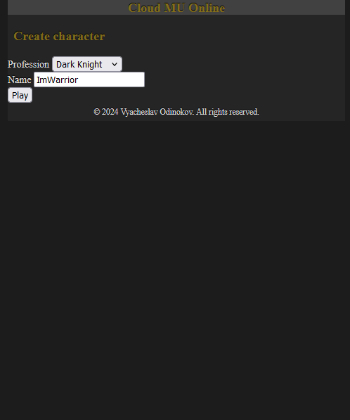

# README

Cloud Mu Online (CMO) is a browser-based MMORPG inspired by the classic Mu Online. Choose from various classes, level up your hero, and become stronger as you discover valuable items. Engage in open PvP battles with other players, and capture and hold the Castle to prove your dominance in the realm!

## Screenshots





This README provides instructions for setting up and running the application.

Things you may want to cover:
* System dependencies

This project is designed to be compatible with standard Oracle Linux 9.3 packages and repositories. We are committed to supporting the latest versions of Oracle Linux to the best of our ability. Any updates to the project will ensure compatibility with the newest releases of Oracle Linux.

While Oracle Linux is the recommended environment, you have the flexibility to use any Linux distribution according to your preferences.

* Ruby version `ruby 3.3.4`

* Bundle version `bundle-2.5.11`

## System configuration

### WSL
If used with WSL2, need to configuure it (you may skip WSL section if not using it).
```shell
sudo nano /etc/wsl.conf
```

Write there:
```bash
[boot]
systemd=true
[network]
generateHosts = false
generateResolvConf = false
```

Reset WSL from windows shell.
```shell
wsl.exe --shutdown
```

Setup DNS.
```shell
sudo nano /etc/resolv.conf
```

Write there:
```bash
nameserver 8.8.8.8
```

### Update the system and download dependencies 
Update and needed instruments.
```shell
sudo dnf update
sudo dnf config-manager --enable ol9_codeready_builder
sudo dnf install nano git curl gpg gcc make libyaml-devel
```

Redis.
```shell
sudo dnf install redis
sudo systemctl start redis
sudp systemctl enable redis
```

Install MySQL.
```shell
sudo dnf install mysql-server mysql-devel
sudo systemctl start mysqld
sudp systemctl enable mysqld
sudo mysql_secure_installation
```

Need to create MySQL user. There is 2 ways to do it.
```shell
mysql -u root -p
```

* For socket authentication
```sql
INSTALL PLUGIN auth_socket SONAME 'auth_socket.so';
CREATE USER 'cmo'@'localhost' IDENTIFIED WITH auth_socket;
GRANT ALL PRIVILEGES ON *.* TO 'cmo'@'localhost';
FLUSH PRIVILEGES;
exit
```

* For passwword authentication
```sql
CREATE USER 'cmo'@'localhost' IDENTIFIED BY 'YOUR_PASSWORD_GOES_HERE';
GRANT ALL PRIVILEGES ON *.* TO 'cmo'@'localhost';
FLUSH PRIVILEGES;
exit
```

Configure ENV variables needed for sidekiq and redis.
```shell
nano .bashrc
```
Write there:
```bash
export SIDEKIQ_USERNAME="admin"
export SIDEKIQ_PASSWORD="admin"

export CMO_DB_USERNAME="cmo"
export CMO_DB_PASSWORD=""
export CMO_DB_SOCKET="/var/lib/mysql/mysql.sock"

export REDIS_PORT="6379"
```
Keep password empty if you are using socket, otherwise fill the password and keep empty socket path.

### Install ruby
In this example we are using RVM. Install it with:
```shell
\curl -sSL https://get.rvm.io | bash -s stable
```

Install specified Ruby version.
```shell
rvm install 3.3.4 --default
```

## Install project
Git clone the project. Setup local bundle and install dependencies.
```shell
git clone https://github.com/Kagayakashi/cloud_mu_online.git
cd cloud_mu_online/
bundle config set --local path 'vendor/bundle'
bundle install
```

Setup database.
```shell
bin/rails db:create
bin/rails db:migrate
bin/rails db:seed
```

Run application and open in browser `localhost:3000`:
```shell
bin/rails s
```

Run sidekiq in parallel aswell:
```shell
bundle exec sidekiq
```
